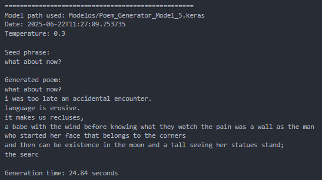

# **Poem Generator Using LSTMs**

This project uses **Long Short-Term Memory (LSTM)** neural networks to generate poems based on a dataset from the Poetry Foundation. It includes data cleaning, model training, and poem generation with customizable parameters.



---

## **Prerequisites**

- **Python version 3.8 - 3.11** must be installed on your system.

---

## **Project Structure**

```
Poem-Generator-Using-LSTMs/
├── cleaning.py                # Preprocesses raw data using regex & pandas
├── main.py                    # Main script for training & generation
├── requirements.txt           # Project dependencies
├── datos_limpios/             # Cleaned text data files
├── Modelos/                   # Trained models (includes a sample model)
├── Results/
│   ├── Evaluations.txt        # Model summaries & metadata
│   └── Poemas_Generados.txt   # Generated poems and generation settings
```

- `cleaning.py`: Cleans the raw poem data using regular expressions and `pandas`, producing four text files of different character lengths in the `datos_limpios/` folder.
- `Modelos/`: Stores all trained models. A pretrained model is provided so you can generate poems without training one.
- `Results/`:
  - `Evaluations.txt`: Contains summaries of each trained model — parameters, dataset info, creation time, etc.
  - `Poemas_Generados.txt`: Logs every generated poem with the model used, seed phrase, temperature, generation time, and more.

---

## **Steps to Run the Project**

### 1. Clone the repository and download the dataset

```bash
git clone https://github.com/cesarsiuu2316/Poem-Generator-Using-LSTMs.git
```

Download the dataset [PoetryFoundationData.csv](https://www.kaggle.com/datasets/tgdivy/poetry-foundation-poems) and place it into the root folder if not already included.

---

### 2. Create and Activate a Virtual Environment

It’s recommended to use a virtual environment:

```bash
# Create the virtual environment using pip
python -m venv venv
```

Or specify Python version:

```bash
py -3.11 -m venv venv
```

Activate it 

```bash
# Activate environment
venv\Scripts\activate
```

---

### 3. Install Dependencies

With the virtual environment active:

```bash
pip install -r requirements.txt
```

---

### 4. Configure the Project

In `main.py`:

- Modify global variables to set training parameters.
- Adjust paths to the dataset and model file.
- To use the an existing pretrained model in the `Modelos/` folder, simply update the path accordingly — training will be skipped.

---

### 5. Run the Project

```bash
# Run to clean data, not required.
python cleaning.py

# Train and run models
python main.py
```

---

## **Model Architecture & Performance**

The best performing model included in `Modelos/` (Model 5) utilizes a deep learning architecture optimized for sequence generation.

### **Architecture Details**
- **Embedding Layer**: Maps the vocabulary (41 unique characters) to a 128-dimensional dense vector space.
- **LSTM Layers**: Two stacked LSTM layers with **512 units** each. The first LSTM layer returns sequences to feed into the second, capturing long-range dependencies in the text.
- **Dropout Layers**: Applied after each LSTM layer to prevent overfitting.
- **Dense Layer**: A final dense layer with a softmax activation function to predict the probability distribution of the next character.
- **Total Parameters**: ~10.3 Million

### **Training Results**
- **Dataset**: Kaggle Poetry Foundation dataset (41 unique characters)
- **Training Epochs**: 20
- **Optimizer**: Adam (Learning rate: 0.0005)
- **Loss Function**: Sparse Categorical Crossentropy
- **Final Accuracy**: ~75.07%